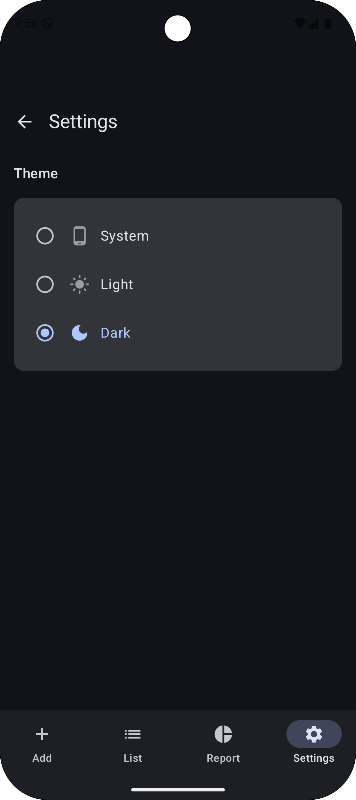

# SpendWise

## 📌 Overview
SpendWise is an **offline-first expense tracking app** built with **Jetpack Compose, Kotlin, Room, MVVM, Hilt, WorkManager**.  
It allows users to add, view, filter, group, and report expenses with support for **CSV/PDF export** and mock offline sync.

---

## 🤖 AI Usage Summary
During development, I used **ChatGPT** as a coding assistant to:
- Scaffold the project structure (MVVM + Clean Architecture).
- Generate Room entities, DAOs, ViewModels, and Composables faster.
- Debug issues like **infinite loading in Flow collectors** and dependency mismatches.
- Add extra features like validation, export, and WorkManager mock sync.

I also referred to **GitHub Copilot** occasionally for autocomplete suggestions inside IDE.  
All AI-generated code was **reviewed, tested, and refactored** manually.

---

## 📝 Prompt Logs
Here are some key prompts used with AI tools during development:

- *"Guide me through the assignment of creating an Android App with Jetpack Compose and Kotlin, Room, MVVM and WorkManager for Offline-first sync (mock)"*
- *"Start with just the Expense Entry Screen and test saving to Room"*
- *"Expense List Screen — view expenses for today (default), previous dates via calendar or filter, group by category or time"*
- *"Simulate PDF/CSV export"*
- *"Bar or line chart (mocked)"*
- *"Validation – enforce non-empty title, amount > 0, category selection"*

---

## ✅ Features Implemented
- [x] Add Expense (Compose UI + Room + MVVM)
- [x] Expense List Screen with date filter, grouping, empty state
- [x] Expense Report Screen with weekly & category summary
- [x] Mock charts (bar & line) for visualization
- [x] Form validation (title, amount, category)
- [x] Offline-first sync using WorkManager (mock upload, mark synced)
- [x] CSV & PDF Export (scoped storage, shareable with FileProvider)
- [x] Navigation with bottom bar (Entry, List, Report)
- [x] Hilt DI setup (Repository, UseCases, Workers)

---

## 📲 APK Download
👉 [Download Debug APK here](https://drive.google.com/file/d/1OYAxYcFD9OHqPHvXLZ0ZfX1V9_BgVrI3/view?usp=sharing)
👉 [Download Release APK here](https://drive.google.com/file/d/1swwMCBZHnkA9lSODTulhKtn2h4gkXYSP/view?usp=sharing)

---

## 🖼️ Screenshots
*(Add your own screenshots in `screenshots/` folder and embed below)*

| Add Expense | Expense List | Expense Report | Settings                                                |
|-------------|--------------|----------------|---------------------------------------------------------|
|  |  |  |  |

---
